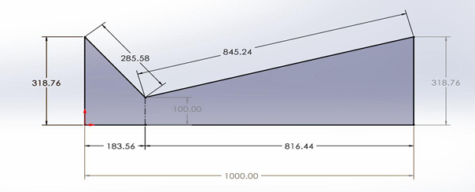
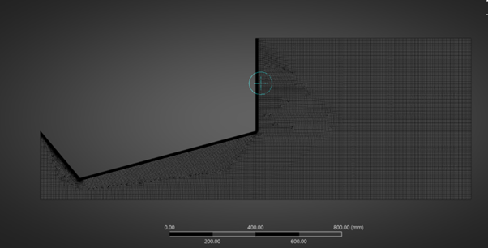
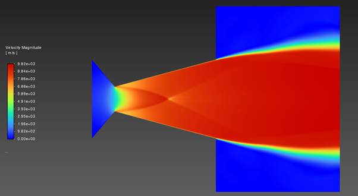
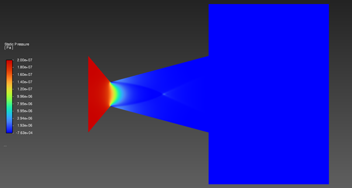
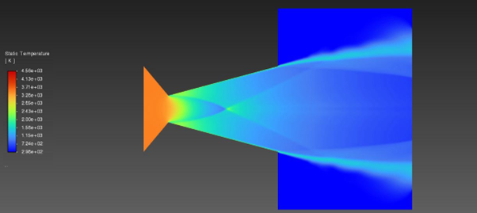
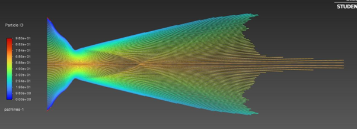
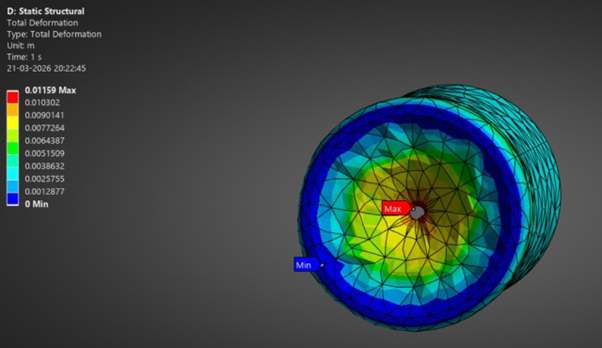
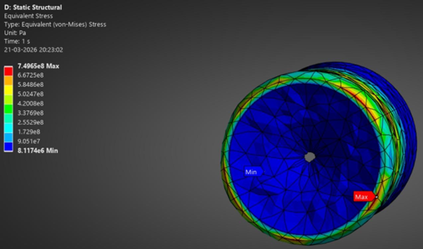
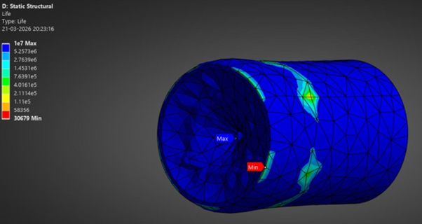

# High Enthalpy Hydrogen Propulsion System

<p align="center">
Finite Element Analysis (FEA), CFD validation, thermal investigation, fatigue assessment, and analytical propulsion modelling using ANSYS Fluent, ANSYS Mechanical, and MATLAB.
</p>

<p align="center">
CFD Analysis • Hydrogen Propulsion • Thermal Simulation • Fatigue Investigation • Aerospace Engineering
</p>

---

# Overview

This project presents a simulation-driven investigation of a high-enthalpy hydrogen propulsion system designed for advanced aerospace propulsion applications.

The work combines:

- CFD validation
- thermal contour analysis
- structural stress investigation
- fatigue performance assessment
- analytical propulsion calculations
- mesh independence validation
- MATLAB propulsion modelling

The objective was to evaluate propulsion system performance under extreme thermal and structural operating conditions while validating engineering feasibility through simulation-driven workflows.

---

# Technical Details

## Software Used

- ANSYS Fluent
- ANSYS Mechanical
- SolidWorks
- MATLAB

---

## Engineering Methodology

- CFD simulation workflow
- compressible flow analysis
- thermal distribution validation
- structural deformation assessment
- equivalent stress analysis
- fatigue life investigation
- propulsion parameter optimisation

---

# Simulation Workflow & Results

---

## 1. Initial Nozzle Geometry

<p align="center">

</p>

<p align="center">
<em>Initial converging-diverging hydrogen propulsion nozzle geometry used for CFD and structural investigation.</em>
</p>

---

## 2. CFD Mesh Investigation

<p align="center">

</p>

<p align="center">
<em>75,000 node computational mesh generated for CFD validation and numerical convergence analysis.</em>
</p>

---

## 3. Velocity Contour Analysis

<p align="center">

</p>

<p align="center">
<em>Velocity contour demonstrating supersonic hydrogen flow acceleration through the propulsion nozzle.</em>
</p>

---

## 4. Pressure Contour Investigation

<p align="center">

</p>

<p align="center">
<em>Pressure distribution contour illustrating pressure reduction throughout nozzle expansion.</em>
</p>

---

## 5. Temperature Contour Investigation

<p align="center">

</p>

<p align="center">
<em>High-enthalpy temperature contour showing thermal behaviour within the propulsion system.</em>
</p>

---

## 6. Velocity Magnitude Investigation

<p align="center">

</p>

<p align="center">
<em>Velocity magnitude results validating high-speed compressible flow behaviour.</em>
</p>

---

## 7. Structural Deformation Investigation

<p align="center">

</p>

<p align="center">
<em>Total deformation contour generated during thermal and pressure loading investigation.</em>
</p>

---

## 8. Equivalent Stress Analysis

<p align="center">

</p>

<p align="center">
<em>Von-Mises equivalent stress distribution used for propulsion nozzle structural validation.</em>
</p>

---

## 9. Fatigue Life Investigation

<p align="center">

</p>

<p align="center">
<em>Fatigue life prediction contour demonstrating nozzle lifecycle behaviour under operational conditions.</em>
</p>

---

# MATLAB Propulsion Modelling

The propulsion system analytical calculations were validated using MATLAB numerical modelling.

```matlab
clc;
clear;

%% 1. Input Parameters
Pc = 40e6;
Tc = 5000;
Pa = 101325;
R  = 4124;
gamma = 1.3;
Rt = 0.1;
epsilon = 20.25;
total_mass = 140000;
g = 9.81;

%% 2. Geometric Calculations
At = pi * Rt^2;
Ae = epsilon * At;

%% 3. Throat Conditions
Tt = Tc * (2 / (gamma + 1));
Vt = sqrt(gamma * R * Tt);

%% 4. Mass Flow Rate
term1 = (At * Pc) / sqrt(Tc);
term2 = sqrt(gamma/R * (2/(gamma+1))^((gamma+1)/(gamma-1)));
mdot = term1 * term2;

%% 5. Exit Mach Number
area_mach_eq = @(M) (1./M) .* ((2/(gamma+1)) .* ...
    (1 + (gamma-1)/2 .* M.^2)).^((gamma+1)/(2*(gamma-1))) - epsilon;

Me = fzero(area_mach_eq, 4);

%% 6. Exit Conditions
Te = Tc / (1 + (gamma-1)/2 * Me^2);
Ve = Me * sqrt(gamma * R * Te);

%% 7. Exit Pressure
Pe = Pc * (1 + (gamma-1)/2 * Me^2)^(-gamma/(gamma-1));

%% 8. Thrust Calculations
Momentum_Thrust = mdot * Ve;
Pressure_Thrust = (Pe - Pa) * Ae;

Total_Thrust = Momentum_Thrust + Pressure_Thrust;

%% 9. Thrust-to-Weight Ratio
TWR = Total_Thrust / (total_mass * g);

%% 10. Display Results
fprintf('Exit Mach Number: %.3f\n', Me);
fprintf('Exit Velocity: %.2f m/s\n', Ve);
fprintf('Total Thrust: %.2f MN\n', Total_Thrust/1e6);
fprintf('TWR: %.2f\n', TWR);
